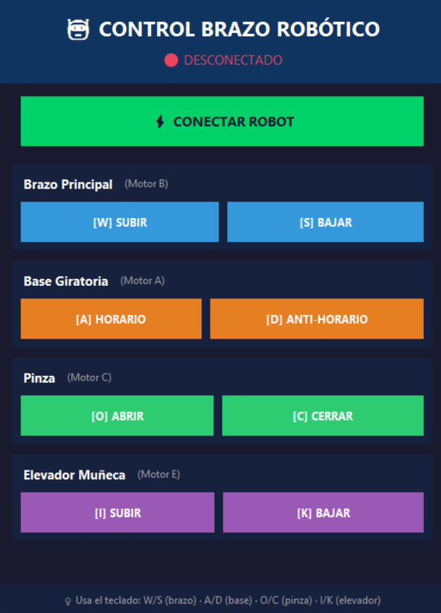

## Proyecto: Brazo Robótico de Lego

Este proyecto implementa una solución robótica teleoperada diseñada para reducir el riesgo humano en la manipulación de cargas en minería subterránea. Utiliza una arquitectura **Cliente-Servidor distribuida** sobre **Bluetooth Low Energy (BLE)**, combinando una interfaz de escritorio en Python (Tkinter + Asyncio) con un controlador embebido en MicroPython (Pybricks).

## Características Principales
    1. Interfaz Gráfica (GUI)
    2. Conexion Bluetooth
    3. Movimiento controlado

## Requisitos Previos

# Hardware
   1x Kit LEGO Education SPIKE Prime (Hub + Motores).
   1x Computador con adaptador Bluetooth 4.0 o superior.
   Cable USB (para la carga de bateria y la instalacion inicial del firmware).

# Software
   Python 3.9 o superior instalado en el PC.
   Navegador de internet (para instalar firmware Pybricks).

## Instalación y Despliegue

# Descarga Rápida (Release)

    Sistema Operativo: Windows 11 (64-bit)
    URL de descarga: https://github.com/M47355/Proyecto-1/releases
    

# Paso 1: Configurar el Servidor (Hub LEGO)
    1.  Ingresa a [Pybricks Code](https://code.pybricks.com/).
    2.  Conecta el Hub LEGO al PC vía USB.
    3.  Instala el firmware de Pybricks siguiendo las instrucciones en pantalla.
    4.  Copia el contenido del archivo `Servidor.py` de este repositorio en el editor online.
    5.  Carga el script en el Hub. Ahora el robot está listo para recibir conexiones Bluetooth.

# Paso 2: Configurar y ejecutar el Cliente por primera vez (PC)
    1.  Descargue y extraiga el código fuente desde la release: https://github.com/M47355/Proyecto-1/releases
    2.  Escriba "cmd" en el buscador de windows y abre el simbolo del sistema, para realizar los pasos 3 y 4
    3.  Instale las dependencias necesarias ejecutando:   
        pip install bleak
        pip install tk
    4.  Abra la ruta de la carpeta extraida usando "cd" (ejemplo):
        cd C:\Users\Juan\Downloads\Proyecto-Vx.y
    5.  Ejecute el cliente: 
        python Cliente.py

## Guia de Operación

    1. Interfaz Gráfica (GUI)
        Ejecute el programa para visualizar la interfaz:
        1.  Abra la ruta de la carpeta extraida usando "cd" (ejemplo):
            cd C:\Users\Juan\Downloads\Proyecto-Vx.y
        2.  Ejecute el cliente: 
            python Cliente.py 

    2. Conexion Bluetooth:
        Encienda su hub LEGO y asegurese de que este buscando dispositivos por bluotooth, encienda el bluetooth de su equipo y presione el boton "CONECTAR ROBOT"
    
    3. Movimiento controlado:
        Luego haber establecido una conexion bluetooth, mantenga presionado los botones de la interfaz, o use los atajos de teclados indicados, para controlar los distintos motores del robot 

## Capturas de Pantalla

# Interfaz Grafica

# Demostracion

